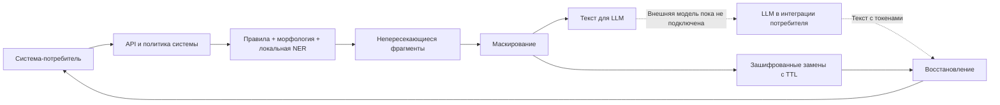

# Архитектура первого прототипа

## Корреляция и ретраи

`/process` реализует контракт организаторов, а `/v1/mask` и `/v1/restore` дают явное направление.
На первый запрос создаются HMAC исходного текста, HMAC маски и замены с координатами.
Повтор исходного текста возвращает ту же маску, повтор маски — тот же исходный текст.
Счётчика переключения фазы нет. При гонке Redis SET NX или PostgreSQL INSERT ON CONFLICT сохраняет одного победителя;
остальные процессы используют его запись. Другой текст под занятым ID получает 409.
Если маскировать нечего, строка обоих направлений одинакова.

## Хранилище и приватность

- В Redis/PostgreSQL/памяти находятся только ciphertext AES-256-GCM и ключи, полученные HMAC; PostgreSQL также хранит срок действия.
- В зашифрованной записи находятся исходные чувствительные фрагменты; весь исходный документ не хранится.
- AES-GCM associated data связывает запись с системой и payload_id. Подмена записи между системами не расшифруется.
- TTL по умолчанию 30 минут. Ретраи его не продлевают; после TTL восстановление недоступно.
- MemoryStore ограничен размером и числом записей, предназначен для одного процесса.
- Redis общий для четырёх процессов. noeviction сохраняет действующие сопоставления; переполнение даёт 429.
- На Vercel экземпляры используют PostgreSQL через общий Neon pooler. TLS проверяет сертификат и имя сервера.
  Запись с истёкшим TTL недоступна сразу; физическая очистка идёт порциями при обращениях.
  Удаление строки не означает немедленного удаления из истории восстановления провайдера.
  Живые записи не вытесняются; исчерпание очереди соединений и ошибки ресурсов SQLSTATE 53 дают 429.
- Кэш детектора содержит HMAC ключи, координаты и типы. Кэш морфологии содержит HMAC слов и грамматические теги.
- Сырые тексты, значения сущностей, API keys и payload_id не попадают в audit/metrics/ошибки.
- Модель исполняется в процессе API. Runtime не вызывает внешнюю LLM и не передаёт текст NLP-провайдерам.
- Это технические меры прототипа; соответствие стандартам ИБ банка не сертифицировано.

## Политики и режим проверки

Рабочая интеграция проверяет X-System-ID и X-API-Key; политика включает типы, формат,
демаскирование, минимальное число типов и зависимость одного типа от другого.
Изменение политики запрещает использование старой записи: клиент должен создать новый payload_id.
Это предотвращает восстановление по устаревшим разрешениям.

Локальный демонстрационный режим доступен только loopback-клиенту без forwarded-заголовков.
Uvicorn запускается с `--no-proxy-headers`, чтобы заголовками нельзя было выдать внешний запрос за локальный.
В Docker local-demo выключен. Отдельный `PII_CHECKER_MODE=1` открывает только `/process` для
проверки, поскольку контракт организатора не описывает авторизацию. Доступ можно дополнительно
ограничить `PII_CHECKER_CIDRS`; IP берётся из сетевого соединения, не из пользовательского заголовка.
При внешнем reverse proxy ограничивать IP нужно также на прокси. Compose по умолчанию публикует
порт только на `127.0.0.1` — публичного развёртывания этот файл сам по себе не создаёт.

## Известные границы

- Отказ хранилища или обработки даёт 503 без исходного текста. Перегрузка/заполнение даёт 429.
- Нет HA-кластера Redis: потеря памяти Redis/перезапуск уничтожает активные сопоставления.
- После истечения состояния `/process` не может всегда отличить чужую маску со звёздочками от нового текста.
  Используйте явный `/v1/restore`, TTL больше интервала между шагами и уникальные ID между прогонами.
- Форматы shape и partial точно восстанавливают только исходную маску. Token восстанавливает фрагменты
  в переставленном и дополненном ответе; неизвестные токены не раскрывают данные другой сессии.
- Исключение исторической персоны намеренно узкое: Александр Пушкин в литературном контексте;
  само слово «поэт» не освобождает произвольное ФИО от маскирования. Нужен более широкий проверенный справочник.
- Адресные поля и числовые идентификаторы остаются эвристическими; независимое тестирование необходимо.
- NLP обрабатывает окна 1900 символов с перекрытием 300. Очень длинные единичные сущности и нестандартные
  разрывы требуют дополнительной проверки. Это ограничение распознавания, а не гарантия SLA на 100000 токенов.
- Метрики: latency histogram, request counter (RPS через rate), типы сущностей, число символов.
  TPS ещё не реализован: число символов не выдаётся за число токенов, токенизатор проверяющей системы неизвестен.
- Реального исходящего LLM proxy, управления политиками без перезапуска и маскирования новых ПД в ответе
  модели пока нет. Сейчас это работающий модуль обработки и API автоматической проверки.
